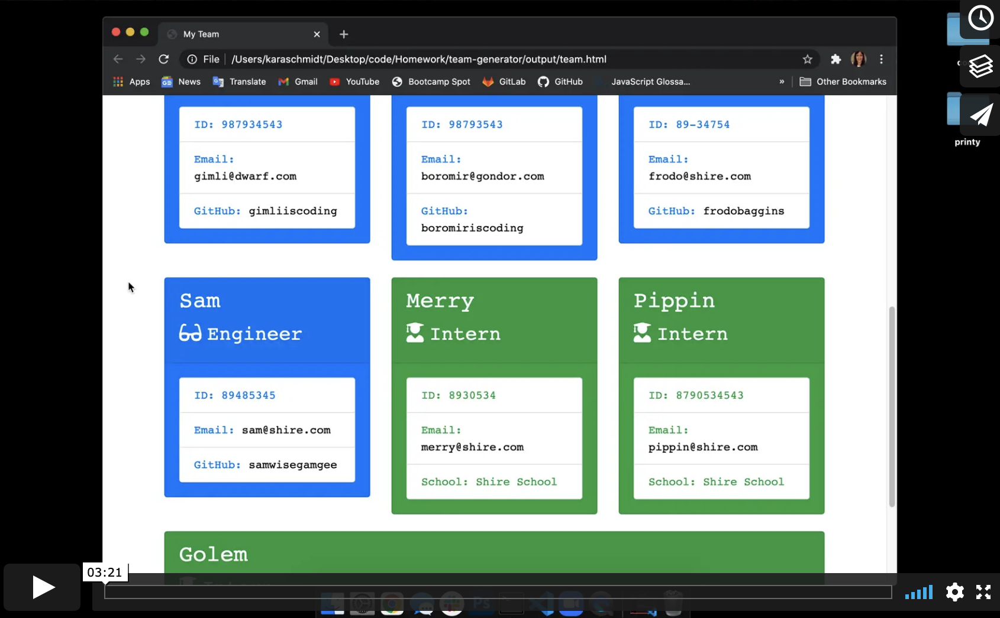

## Team-Generator

## Table of Contents
- [Description](#project-description)
- [Installation](#installation)
- [Usage](#usage)
- [License](#license)

## Project Description 
Team-Generator is a CLI application which takes in employee data and sequences it to a sleek responsive website. The application is run in a CLI and the employee data is entered one by one through a series of prompts. After all employee info is entered, the information is written to HTML and produces complete HTML file which displays the information color-coded by role in hierarchical order from manager to intern.

## Installation 
Download/unpack or clone the repo and then run 'npm install' using a CLI.

## Usage 
Follow the prompts after running the application with the CLI command 'node app.js'. After confirming "no" to the prompt which asks if you want to add more employees you can find the "team.html" file in the Output folder!

## License
This project is licensed under MIT License. Not sure what that means? Please check out [choosealicense.com/licenses/](https://choosealicense.com/licenses/) for more information.
